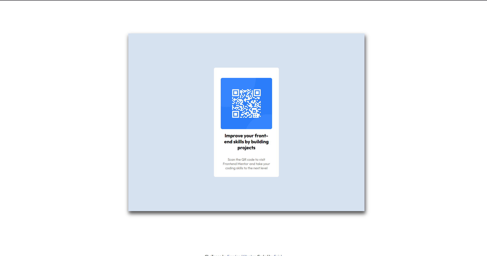

# Frontend Mentor - QR code component solution

This is a solution to the [QR code component challenge on Frontend Mentor](https://www.frontendmentor.io/challenges/qr-code-component-iux_sIO_H). Frontend Mentor challenges help you improve your coding skills by building realistic projects. 

## Table of contents

- [Overview](#overview)
  - [Screenshot](#screenshot)
  - [My process](#my-process)
  - [What I learned](#what-i-learned)
  - [Author](#author)

**Note: Delete this note and update the table of contents based on what sections you keep.**

## Overview
this is a basic html and css project of qr code scanner

### Screenshot

### Links

- Solution URL: [Add solution URL here](https://your-solution-url.com)
- Live Site URL: [Add live site URL here](https://your-live-site-url.com)

## My process
- make 4 divs
- set bg color and set apt padding of mid div
- set a fixed width of in1 div to make the text vertical
-make in2 flex and direction column to align those elements to center in vertical
### Built with

- Semantic HTML5 markup
- CSS custom properties
- Flexbox
- CSS Grid

**Note: These are just examples. Delete this note and replace the list above with your own choices**

### What I learned
for the text to be aligned below the qr code img set the width of the div to a fixed size which is smaller like 150px then the text adjusts itself to downwards.

